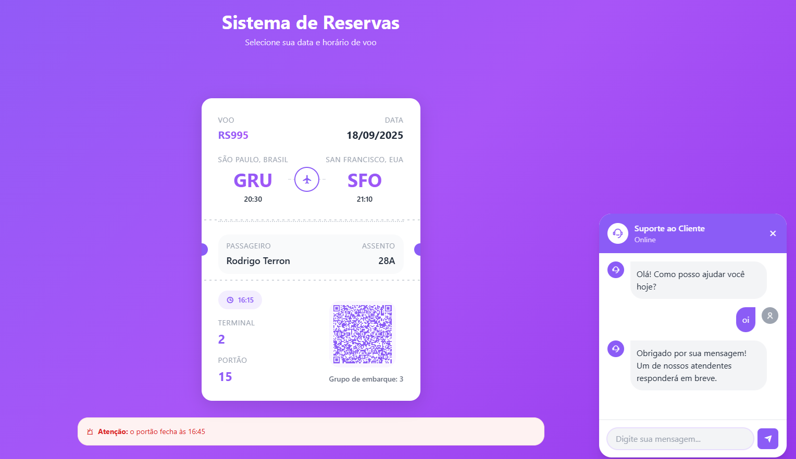
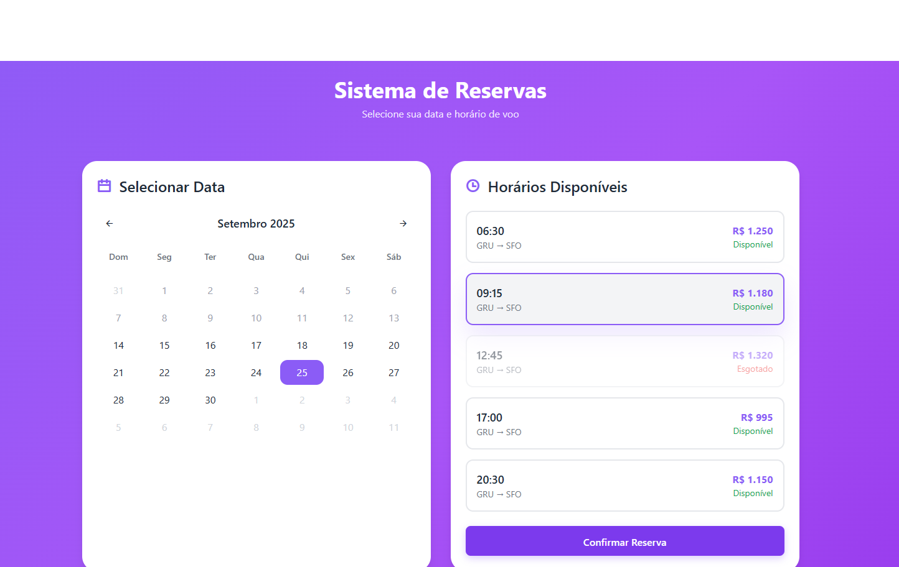

# Sistema de Reservas de Voo - Estrutura Modular e Semântica

<div align="center">
  
</div>

---

**Desenvolvedor:** Luan Oliveira dos Santos  
**Projeto:** Desafio Dev Day  
**Data:** 2025

Este projeto foi modularizado e refatorado para usar HTML semântico e CSS com variáveis, garantindo melhor organização, acessibilidade e manutenibilidade do código. Foi desenvolvido como parte do desafio do Dev Day, demonstrando boas práticas de desenvolvimento front-end.

## 🚀 Demonstração do Sistema

<div align="center">
  
</div>

## Estrutura de Arquivos

```
core/
├── css/
│   ├── main.css          # Arquivo principal que importa todos os estilos
│   ├── variables.css     # Sistema de variáveis CSS (Design System)
│   ├── base.css          # Estilos base e reset
│   ├── calendar.css      # Estilos do componente calendário
│   ├── flight-options.css # Estilos das opções de voo
│   ├── ticket.css        # Estilos do ticket de embarque
│   └── chat.css          # Estilos do widget de chat
├── js/
│   ├── app.js            # Módulo principal da aplicação
│   ├── calendar.js       # Funcionalidade do calendário
│   ├── chat.js           # Funcionalidade do chat
│   └── booking.js        # Sistema de reservas
├── assets/               # Recursos estáticos (imagens, etc.)
└── README.md             # Documentação do projeto
```

## Módulos JavaScript

### app.js
- Módulo principal que inicializa toda a aplicação
- Gerencia a inicialização dos outros módulos
- Ponto de entrada da aplicação

### calendar.js
- Classe `Calendar` responsável pela funcionalidade do calendário
- Métodos para renderização, seleção de datas e navegação entre meses
- Gerenciamento de estado da data selecionada

### chat.js
- Classe `ChatWidget` para funcionalidade do chat de suporte
- Métodos para envio e recebimento de mensagens
- Interface do widget de chat

### booking.js
- Classe `BookingSystem` para sistema de reservas
- Integração com o calendário para seleção de voos
- Geração de QR codes para tickets
- Gerenciamento do fluxo de reserva

## Sistema de Design e CSS

### variables.css
- Sistema completo de variáveis CSS (Design System)
- Cores, espaçamentos, tipografia, sombras e transições
- Suporte a modo escuro (preparado para implementação futura)
- Facilita manutenção e consistência visual

### main.css
- Arquivo principal que importa todos os outros estilos
- Estilos globais e classes utilitárias
- Configurações de botões e componentes

### Componentes CSS
Cada componente tem seu próprio arquivo CSS usando variáveis:
- `base.css`: Estilos base, reset e acessibilidade
- `calendar.css`: Estilos específicos do calendário
- `flight-options.css`: Estilos das opções de voo
- `ticket.css`: Estilos do ticket de embarque
- `chat.css`: Estilos do widget de chat

## HTML Semântico

### Elementos Semânticos Utilizados
- `<header>`: Cabeçalho da página
- `<main>`: Conteúdo principal
- `<section>`: Seções de conteúdo
- `<article>`: Componentes independentes (calendário, opções de voo, ticket)
- `<nav>`: Navegação e botões de ação
- `<aside>`: Widget de chat e avisos
- `<footer>`: Rodapé de seções

### Acessibilidade
- Atributos ARIA para melhor navegação por leitores de tela
- Labels descritivos para elementos interativos
- Estrutura semântica clara
- Suporte a navegação por teclado
- Classes `.sr-only` para conteúdo acessível apenas a leitores de tela

## Como Usar

1. Abra o arquivo `index.html` em um navegador moderno
2. O sistema carregará automaticamente todos os módulos
3. Todas as funcionalidades permanecem as mesmas da versão original

## 🛠️ Tecnologias Utilizadas

<div align="center">
  
  
  
  
  
  
</div>

### Principais Tecnologias:
- **HTML5** - Estrutura semântica
- **CSS3** - Estilos com variáveis e design system
- **JavaScript ES6+** - Módulos e classes
- **Tailwind CSS** - Framework CSS utilitário
- **QRCode.js** - Geração de códigos QR
- **Remix Icons** - Biblioteca de ícones
- **PNG** - Imagens raster para capturas de tela
- **SVG** - Gráficos vetoriais para assets

## Funcionalidades

- ✅ Seleção de data no calendário
- ✅ Visualização de horários disponíveis
- ✅ Seleção de voo
- ✅ Geração de ticket com QR code
- ✅ Chat de suporte ao cliente
- ✅ Interface responsiva
- ✅ Código modular e organizado
- ✅ HTML semântico para melhor acessibilidade
- ✅ Sistema de variáveis CSS para manutenibilidade
- ✅ Design System consistente
- ✅ Suporte a leitores de tela
- ✅ Navegação por teclado

## 👨‍💻 Desenvolvedor

<div align="center">
  
  
  **Luan Oliveira dos Santos**
  
  *Desenvolvedor Front-end*
  
  [](https://github.com/luanoliveira)
  [](https://linkedin.com/in/luanoliveira)
  [](https://luanoliveira.dev)
</div>

---

<div align="center">
  <p><strong>Projeto desenvolvido para o Desafio Dev Day 2025</strong></p>
  <p>Demonstrando boas práticas de desenvolvimento front-end moderno</p>
</div>
